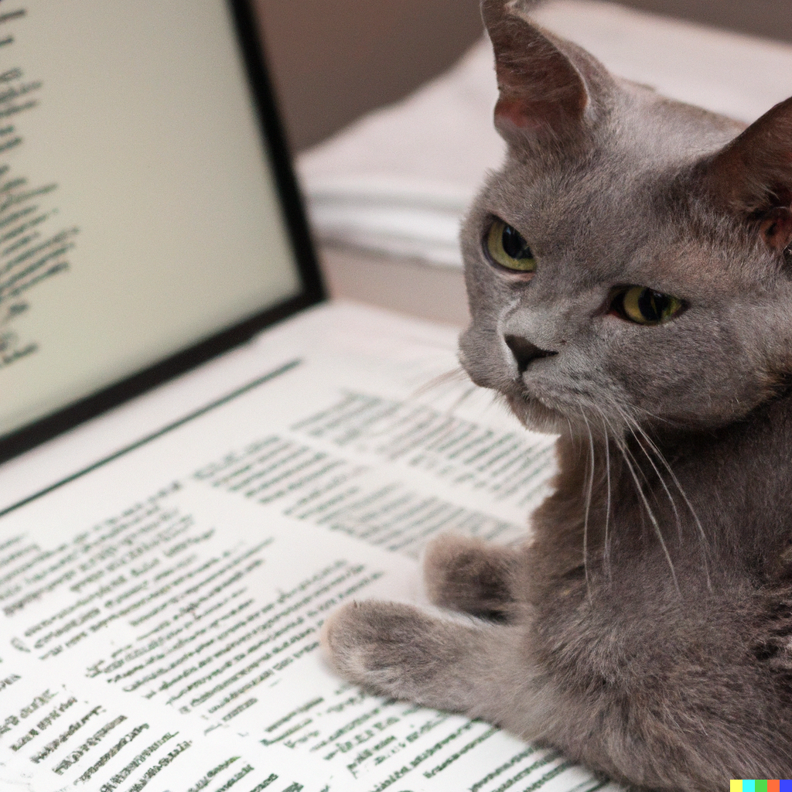
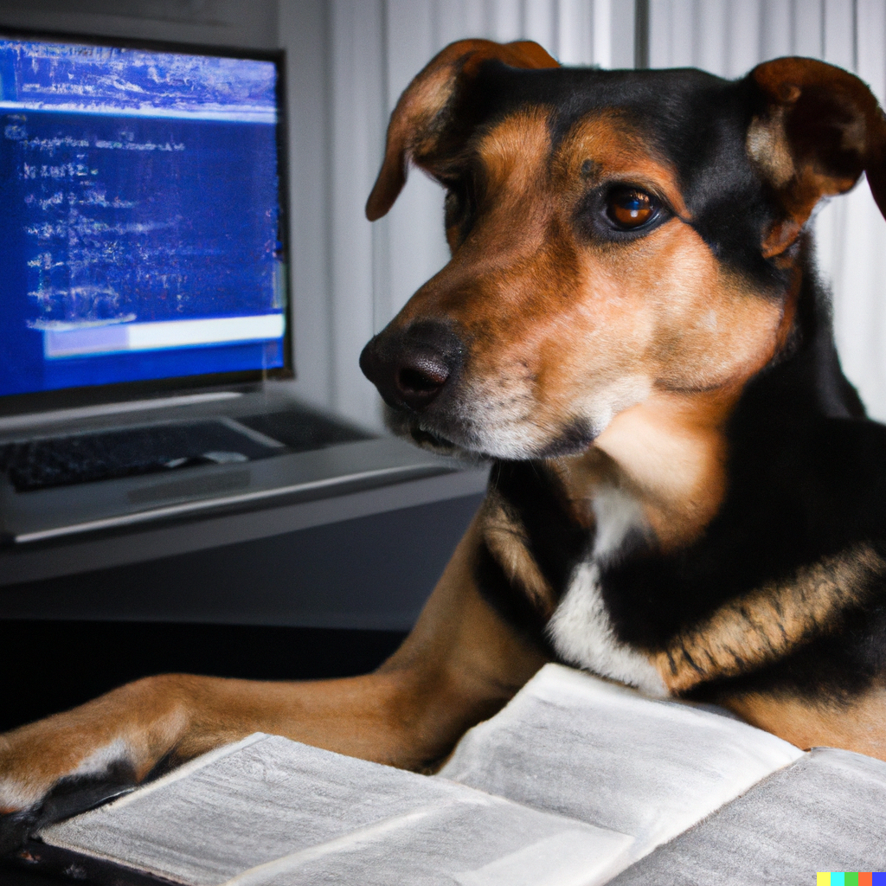

| Ioana-Madalina SILAI                         | Kehina MANSERI                            |
| ----------------------------------- | ----------------------------------- |
|  |  |
| À la suite d'une licence en français et allemand à l'Université de York au Royaume-Uni et ensuite un master en pédagogie, j'ai travaillé comme professeure de langues au lycée pendant 3 ans. J'ai ensuite choisi de m'orienter vers un master TAL. | Issue d'une licence LLCER anglais à l'Université Sorbonne-Nouvelle, j'ai travaillé pendant l'intégralité de ma licence en tant qu'assistante archiviste à l'université de Nanterre. Je me suis ensuite orientée vers le master TAL pour renouer avec l'informatique.   |
|**Hobbies** : séries, jouer aux jeux-vidéos, faire la cuisine, faire des randonnées, dormir, faire à manger à Kehina.   | **Hobbies** : cinéma, comic-books, aller à des concerts, jouer aux jeux-vidéos, dormir chez Maddie. |
|**Langues parlées** : roumain, anglais, français, espagnol, italien, russe et allemand. |**Langues parlées** : français, anglais et espagnol.  |
| [Github](https://github.com/ims510) | [Github](https://github.com/KehinaleK) |

*images générées à l'aide de DALL-E