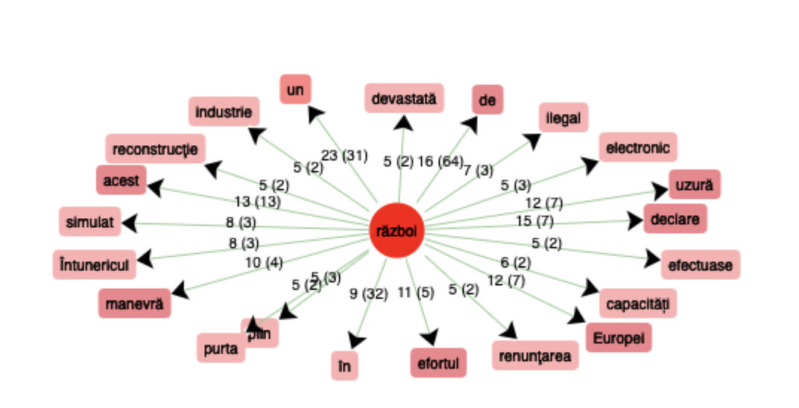
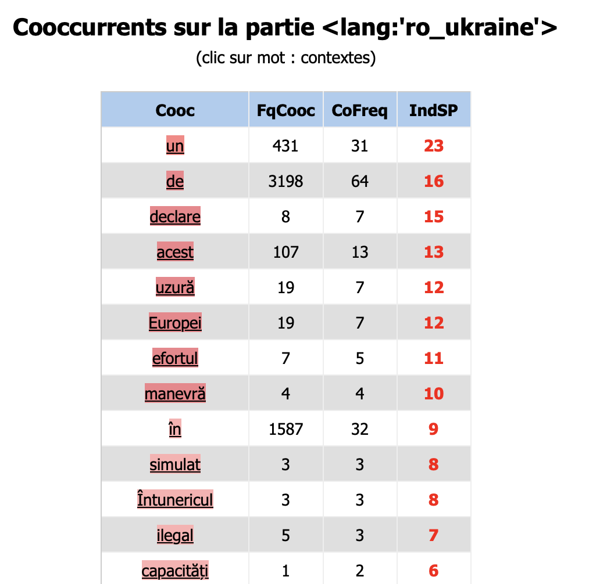
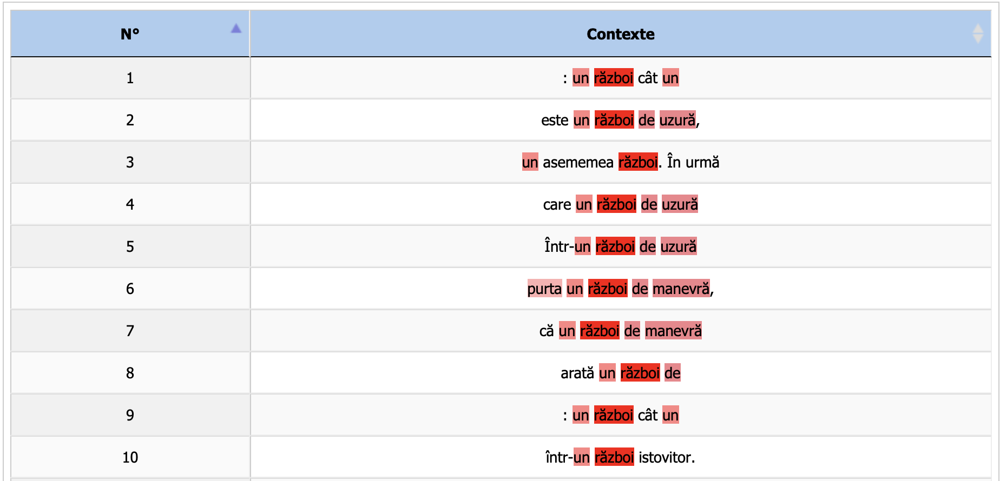
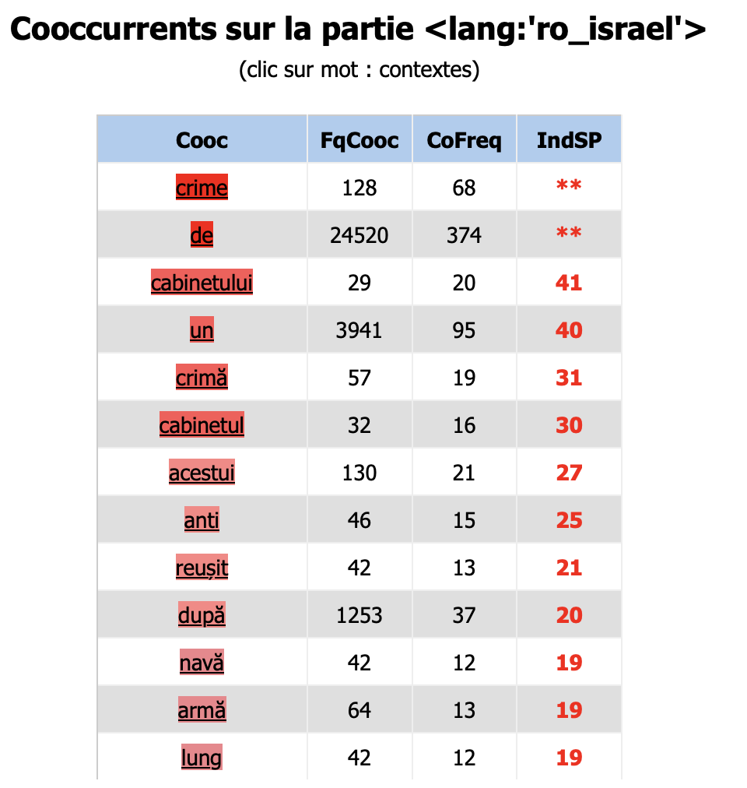
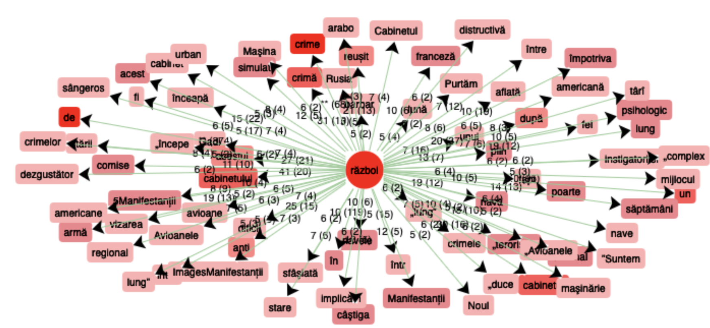
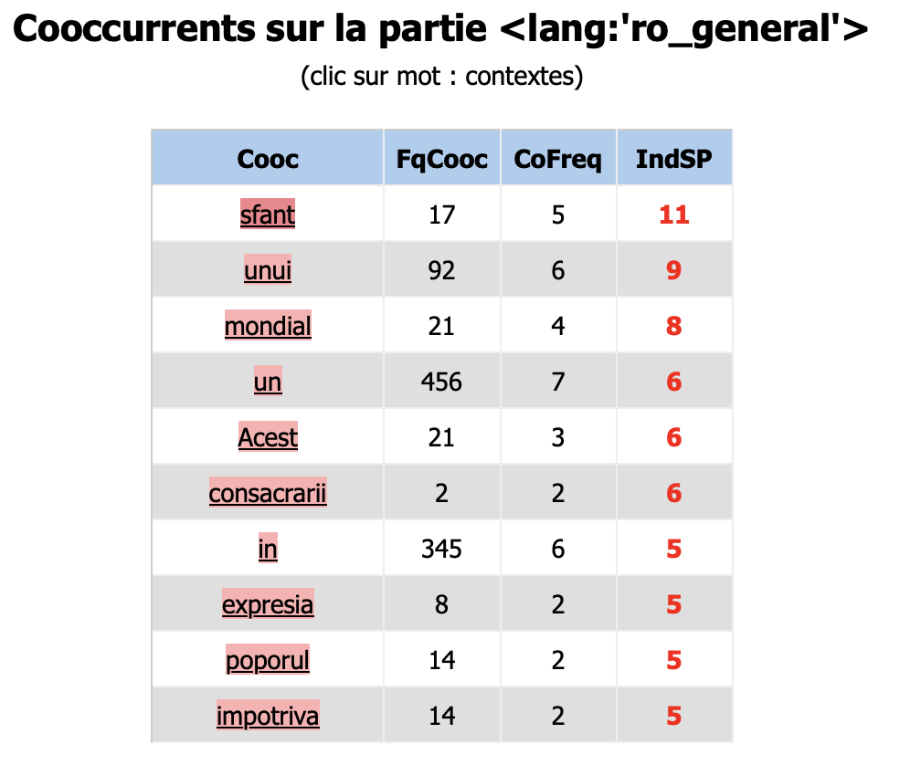

# Analyse utilisant iTrameur:

L'analyse ci-dessous est réalisée à partir de l'outil d'analyse textométrique iTrameur.

En utilisant le script qui se trouve [ici](INSERT LINK).
, on a obtenu un fichier texte contenant les dumps, donc le texte de toutes les pages web choisies dans le cadre de ce projet. Ce fichier contient aussi les balises nécessaires pour que iTrameur puisse bien tokeniser et analyser le contenu des articles.

Comme dans le reste de notre analyse, on a divisé nos articles en 3 parties: ceux sur la guerre en Ukraine, ceux sur le conflit israelo-palestinien et des articles donnant des informations plus generales sur la guerre. Comme ça on peut bien determiner si les mots utilisés autour du mot "guerre" sont differents lorsqu'on parle des differents conflits.

### Guerre en Ukraine

En regardant les coocurents du mot guerre (război), au singulier et sans aucun article, on voit que les mots les plus frequents et avec un indice de specificité élévé qui se trouvent autour du mot cible sont des mots comme "un" ou "de", qui ne nous interessent pas beaucoup. On voit cependent des mots comme "declare" (_déclare_), "uzura" (_usure_), "Europei" (_de l'Europe_), "efortul" (_l'effort_), "manevra" (_manoeuvre_). 

On observe donc une tendence vers des mots assez techniques, l'idée d'appartenence à l'Europe et l'idée d'un effort et de la durée. En particulier le mot  "uzura" (_usure_) est intéressant ici, car la guerre d'usure est un conflit qui se joue sur la durée, dans le but de faire céder l'adversaire. 

 



En ce qui concerne le contexte, parmi les mots qu'on a déjà mentionné on voit aussi "într-un război istovitor" (_dans une guerre fatiguante_) confirmant donc cette image d'une guerre longue, qui se joue sur de nombreuses petites avancées.



### Guerre entre Israel et Palestine

Les coocurences du mot guerre dans le contexte du conflit israelo-palestinien confirme notre hypothese, car les mots qui se retrouvent autour du mot cible sont en effet très différents.

 

Le premier mot dans la liste c'est "crime" (_crimes_), suivi par des mots comme "cabinetului" (_du cabinet (de ministres)_), "crimă" (_crime_), "anti" (_anti_), "reuşit" (_réussi_), "navă"(_navire_), "armă" (_arme_). On voit donc que l'image créée dans les articles sur ce conflit est beaucoup plus violente. En plus, c'est intéressant de trouver un mot de la sphere politique avec un indice de specificité si élévé - démontrant ainsi un lien beaucoup plus fort entre le gouvernement des pays impliqués et le conflit.

Lorsqu'on regarde l'image d'ensemble on observe encore mieux un grand nombre des mots violents (destructive, sanglant, degoutant, ravagé), ainsi que des mots faisant reference à d'autre pays (français, la Russie, americaines) ce qui montre l'aspect moins européen, et plutôt global de ce conflit. 



### Guerre en général

Si on analyse les articles qui parle de la notion de guerre en général, on observe des mots complétement differents à ceux qu'on a vu jusqu'ici.

Le mot avec l'indice de specificité le plus élévé est le mot "sfant" (_saint_), suivi par des mots comme "mondial", "consacrarii" (_consacrer_), "expresia" (_l'expression_), "poporul" (_le peuple_), "impotriva" (_contre_). Cela nous indique que lorsqu'on parle de la guerre en general on parle plutot des guerres de l'histoire, commme les guerres à cause des raisons religieuses ou les deux Guerres Mondiales. Aussi le mot _contre_ dépeint une image plus simple de la guerre, ou il s'agit d'une lutte claire d'une partie contre l'autre. 



# Analyse utilisant PALS:

En utilisant le script Python PALS, on a pu completer l'image obtenue par iTrameur grâce au fait qu'on a la possibilité d'utiliser des expressions regulieres. Dans le cas du roumain en particulier, on s'attendait que les differences entre les resultats soient signficatives, car en roumain les differents articles s'ajoutent sous la forme des suffixes. En prennant donc juste le mot "război" on elimine en fait des formes comme "la guerre", "les guerres", "à la guerre", "aux guerres", "des guerres" etc. 

Pour utiliser ce script il a fallu ajuster notre corpus, pour qu'il soit dans le format adequat, ce qu'on a fait en utilisant le script ici. 

La commande utilisé pour obtenir les résultats nécessaires a été:

```python3 cooccurrents.py ../../itrameur/dump-pals-ro_ukraine.txt --target "[Rr]ăzbo((iul)|(iului)|(aiele)|(aie)|(aielor)|i)" --match-mode regex -N 10 --tool-emulation itrameur```

### Guerre en Ukraine

Dans le cas des articles sur la guerre en Ukraine on obtient les resultats suivants:

| token         | corpus size    | all contexts size | frequency        | co-frequency     | specificity |
|---------------|----------------|-------------------|------------------|------------------|-------------|
| Ucraina       | 64027          | 3510              | 522              | 155              | 70.03       |
| ziua          | 64027          | 3510              | 43               | 31               | 30.25       |
| în            | 64027          | 3510              | 1590             | 184              | 22.16       |
| Israel        | 64027          | 3510              | 23               | 19               | 21.13       |
| uzură         | 64027          | 3510              | 19               | 17               | 20.27       |
| din           | 64027          | 3510              | 780              | 108              | 19.08       |
| Studiul       | 64027          | 3510              | 13               | 12               | 15.05       |
| folosesc      | 64027          | 3510              | 13               | 11               | 13.03       |
| Unităţile     | 64027          | 3510              | 8                | 8                | 11.09       |
| International | 64027          | 3510              | 14               | 10               | 10.71       |

On voit donc quelques mots qui sont similaires aux resultats obtenus sur iTrameur, comme "uzură", mais aussi des mots assez différents. D'un côté on peut observer des mots auquel on s'attendait étant donné le contexte comme "Ucraina", "ziua" (_le jour_) car beaucoup d'articles présentent la situation jour par jour. Il y a aussi le mot "Israel" qui provient probablement des liens vers d'autres articles. 

D'un autre côté il est interessant de trouver le mot "international", étant donné que dans l'analyse précedent on a trouvé des mots suggerant un lien de cette guerre avec l'europe, plutôt qu'avec la sphere internationale. Cela rapproche donc l'image de cette guerre avec celle de Gaza. 

### Guerre entre Israel et Palestine

C'est interessant ici de voir le mot "declanşat" (_declenché_), alors que dans l'analyse iTrameur du mot guerre dans le contexte du conflit en Ukraine on avait trouvé le mot "declarat" (_declaré_). Si on ajoute aussi le mot "începutul" (_le debut_) on peut faire une analyse semantique simple à partir de ces données. 

En effet, cela nous revele une difference importante dans l'image qu'on presente du debut de ce conflit - il s'agit en effet d'un conflit declenché, qu'on ne peut pas contrôler ou changer. Dans le cas du mot "declaré" il s'agit plutôt d'un conflit choisi, qu'on aurait pu eviter. 

C'est interessant aussi de voir le nom Hamas ainsi que le mot "împotriva" (_contre_), qui forme cette image simple d'une guerre "classique" contre un inamique bien defini. Ceci est assez proche de l'image qu'on a obtenu lors de l'analyse iTrameur du mot "guerre" dans un contexte plus general. 


| token     | corpus size    | all contexts size | frequency        | co-frequency     | specificity |
|-----------|----------------|-------------------|------------------|------------------|-------------|
| Israel    | 498973         | 15971             | 2111             | 406              | 186.39      |
| începutul | 498973         | 15971             | 341              | 187              | 182.53      |
| crime     | 498973         | 15971             | 135              | 97               | 112.92      |
| Împotriva | 498973         | 15971             | 744              | 134              | 59.14       |
| ziua      | 498973         | 15971             | 100              | 55               | 55.10       |
| Hamas     | 498973         | 15971             | 5113             | 385              | 52.46       |
| Declanşat | 498973         | 15971             | 77               | 47               | 50.38       |
| Război    | 498973         | 15971             | 117              | 51               | 44.52       |
| dintre    | 498973         | 15971             | 1172             | 145              | 43.36       |
| crimă     | 498973         | 15971             | 60               | 34               | 35.36       |

### Guerre en général

Ici on voit clairement des mots décrivant la Premiere Guerre Mondiale ("Primul" _le premier_, "Germaniei" _à l'Allemagne_), ainsi que la Guerre Froide ("Rece" _Froide_). C'est interessant quand même de voir que le mot "declarat" (_déclaré_) se retrouve sur cette liste, car cela correspond aux faits historiques. 

| token     | corpus size    | all contexts size | frequency        | co-frequency     | specificity |
|-----------|----------------|-------------------|------------------|------------------|-------------|
| Primul    | 79007          | 6208              | 55               | 55               | 61.86       |
| Primului  | 79007          | 6208              | 27               | 25               | 26.16       |
| mondial   | 79007          | 6208              | 23               | 17               | 15.00       |
| declarat  | 79007          | 6208              | 23               | 17               | 15.00       |
| celui     | 79007          | 6208              | 18               | 15               | 14.77       |
| Germaniei | 79007          | 6208              | 58               | 25               | 13.56       |
| timpul    | 79007          | 6208              | 55               | 23               | 12.29       |
| Franței   | 79007          | 6208              | 22               | 14               | 11.25       |
| Rece      | 79007          | 6208              | 9                | 9                | 10.94       |
| în        | 79007          | 6208              | 1722             | 206              | 10.31       |