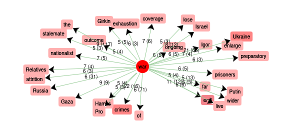
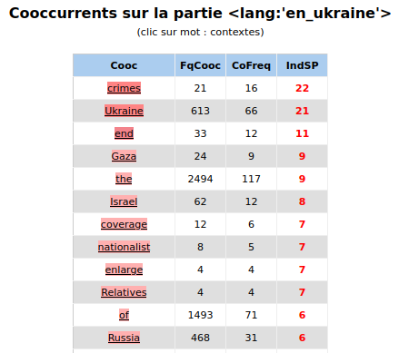
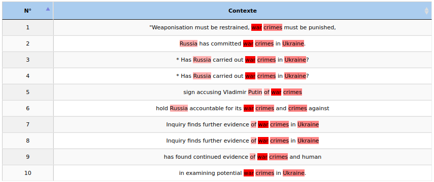
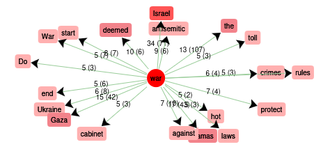
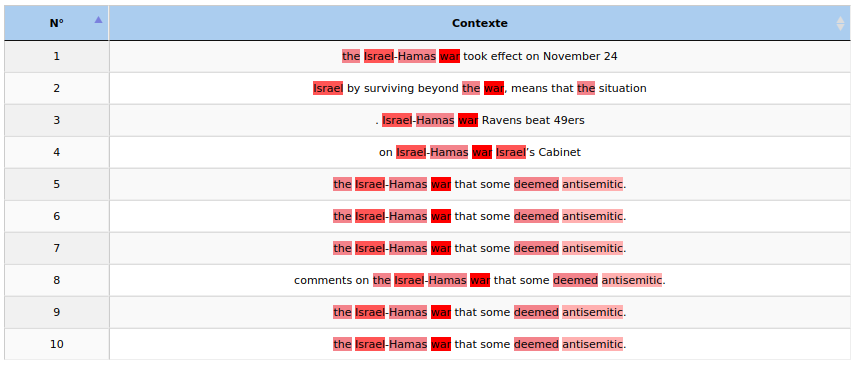
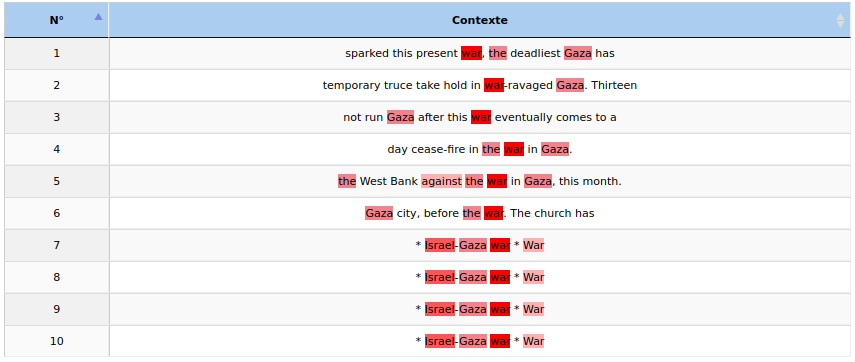
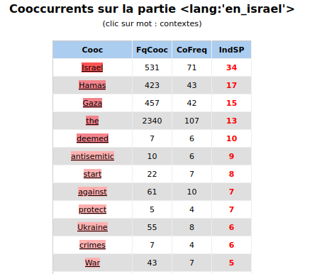
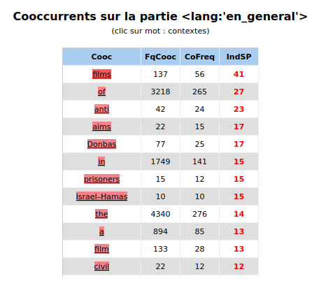
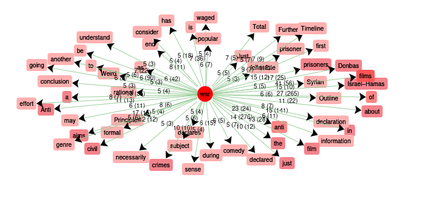

# Analyse utilisant iTrameur:

L'analyse ci-dessous est réalisée à partir de l'outil d'analyse textométrique iTrameur.

En utilisant le script qui se trouve [ici](INSERT LINK).
, on a obtenu un fichier texte contenant les dumps, donc le texte de toutes les pages web choisies dans le cadre de ce projet. Ce fichier contient aussi les balises nécessaires pour que iTrameur puisse bien tokeniser et analyser le contenu des articles.

Comme dans le reste de notre analyse, on a divisé nos articles en 3 parties : ceux sur la guerre en Ukraine, ceux sur le conflit israelo-palestinien et des articles donnant des informations plus generales sur la guerre. Comme ça on peut bien determiner si les mots utilisés autour du mot "guerre" sont differents lorsqu'on parle des differents conflits.

### Guerre en Ukraine

En regardant les coocurences du mot "war" dans notre corpus, nous remarquons premièrement la présence de deux mots à fonction grammaticale "of" (_de_) et "the" (_le,la,les_) qui ne nous intéresseront ici pas pour notre analyse. La grande majorité des mots coocurents à "war" sont des mots à fonction lexicale. Nous remarquons ensuite que dans notre corpus "Ukraine", nous retrouvons de nombreuses coocurences avec les mots "Gaza", "Israel" et "Hamas". Nous pouvons ici également ignorer ces mentions, il semblerait en effet que ces dernières soient dues aux articles suggerés sur nos pages web concernant l'Ukraine. 

Dans notre corpus, l'accent semble être mis sur les idées de "durée" et de "fatigue" exprimées par l'adverbe "ongoing" (_en cours_) et les noms "exhaustion" (_épuisement_) et "outcome" (_dénouement_). Cette dimension est au coeur de la couverture médiatique de cette guerre souvent décrite comme "longue" et jouant sur le moral des populations victimes du conflit. Ces coocurences ne laissent pas place à l'émotion qui aurait pu être exprimée via des adjectifs ou autres adverbes. Ici, le vocabulaire utilisé reste neutre, celui d'un article visant à amener l'information, comme incarné par les coocurences avec le nom "coverage" (_couverture médiatique_). Nous pouvons cependant deviner une tendance à dénoncer les crimes commis et contraire aux droits de l'homme. Le mot "war" est très fréquemment accompagné de "crimes" (_crimes_) pour former le compound noun "war crimes" (_crimes de guerre_). Cette dénonciation, associée à la dimension de "fatigue" mise en avant par le corpus laisse à entendre que les médias anglophones sont en faveur d'une fin de conflit.

 



En analysant le contexte de notre premier résultat "crimes" dans notre corpus, nous observons qu'il est utilisé en majorité comment objet direct du sujet "Russia" (_Russie_). Ces "war-crimes" sont effectués par la Russie sur l'Ukraine. Cela confirme notre hyptohèse de dénonciation des crimes de guerre de l'un des parties de ce conflit. La russie n'est ici pas seulement décrite comme commetant des crimes de guerre, elle est dénoncée (exprimé par "accountable" (_tenu responsable_) et "punished" (_sanctionné_)). Nous pouvons donc reconnaître un soutien clair pour l'Ukraine dans notre corpus de médias anglophones.



### Guerre entre Israel et Palestine

Les coocurences du mot "war" dans nos deux corpus sont différentes, permettant donc éventuellement de corroborer l'hypothèse que le traitement des deux conflits dans les médias est différent. 

 

Le premier mot observé autour du mot "war" est ici "Israel" suivi de "Hamas" et "Gaza". Ces coocurences montrent une importance particulière donnée aux protagoniste du conflit. Si "Ukraine" était également très fréquemment associé à "war", "Russia" l'était beaucoup moins. Nous pouvons également noté qu'"Hamas" et "Gaza" sont utilisés à une fréquence presque identique aux côtés de "war". Cela veut-il cependant dire que ces deux dénominations sont utilisées de manière interchangeable ?



Nous pouvons voir que le terme "Hamas" est le plus souvent utilisé pour nommer le conflit avec Israël. Nous pouvons également voir qu'il est généralement associé au terme "antisemitic" (_antisémite_), également très fréquemment retrouvé aux cotés du mot "war".




Si "Gaza" se retrouve également dans la dénomination "Israel-Gaza war", le terme est plus souvent utilisé pour décrire la localisation géographique du même nom.

Là ou "Ukraine" définissait à la fois le peuple et le pays, nous observons que les médias cherchent à différencier le territoire des "ennemis" ici. Une distinction (à des degrés différents cependant, "Gaza" reste très utilisé dans la dénomination "Israel-Gaza war") semble être faite entre le "Hamas" et le territoire palestinien. 



Nous pouvons enfin observer une fréquence élevée de coocurence de "war" avec "deemed" (_consideré_). Ce terme dénote grandement avec l'aspect bien plus neutre exprimé par les médias anglophones et le terme "coverage" (_couverture médiatique_). Nous voyons de plus qu'une idée d'opposition forte est ici mise en avant avec les termes "against" (_contre_), "antisemitic" et "protect" (_protéger_). Les mots entourant "war" n'ont donc rien à voir avec la dimension de "fatigue" que nous retrouvions dans le corpus précédent. Nous n'avons aucune mention de "end" (_fin_) mais pouvons voir la présence de "start" (_début_). D'après les médias anglophones, le conflit n'en est qu'à son début et oppose fortement plusieurs protagonistes dont les dénominations ne sont pas claires.

Nous avons donc bien une différence de traitement de ces deux conflits par les médias anglophones.

### Guerre en général

Si on analyse les articles qui parle de la notion de guerre en général, on observe des mots complétement differents à ceux qu'on a vu jusqu'ici.

Nous obtenons notamment "films" (_films_) en premier résultat, associant ainsi les guerres à la culture pour la première fois. Nous obtenons ensuite des noms de conflits comme "Donbas" ainsi que les termes "anti" et "civil" rappelant la dimension moins nuancée de la guerre : celle d'opposition entre deux entités.

 


# Analyse utilisant PALS:

En utilisant le script Python PALS, on a pu completer l'image obtenue par iTrameur grâce au fait qu'on a la possibilité d'utiliser des expressions regulieres. Dans le cas de l'anglais, nous ne nous attendions pas à des différences considérables au vu de la seule déclinaison du mot au pluriel.

Pour utiliser ce script il a fallu ajuster notre corpus, pour qu'il soit dans le format adequat, ce qu'on a fait en utilisant le script ici. 

La commande utilisé pour obtenir les résultats nécessaires a été:

```python3 cooccurrents.py ../../itrameur/dump-pals-en_ukraine.txt --target "(W|w)ars?" --match-mode regex -N 10 --tool-emulation itrameur```

### Guerre en Ukraine

Dans le cas des articles sur la guerre en Ukraine on obtient les resultats suivants:

| Token    | Corpus size | All contexts size | Frequency | Co-frequency | Specificity |
|----------|-------------|-------------------|-----------|--------------|-------------|
| Ukraine  | 53436       | 2216              | 616       | 95           | 28.72       |
| crimes   | 53436       | 2216              | 21        | 16           | 18.92       |
| end      | 53436       | 2216              | 33        | 17           | 15.75       |
| Gaza     | 53436       | 2216              | 24        | 13           | 12.79       |
| Study    | 53436       | 2216              | 8         | 8            | 12.06       |
| Video    | 53436       | 2216              | 15        | 10           | 11.45       |
| Israel   | 53436       | 2216              | 62        | 17           | 10.48       |
| Russia   | 53436       | 2216              | 474       | 50           | 9.86        |
| Climate  | 53436       | 2216              | 13        | 8            | 9.05        |
| Cold     | 53436       | 2216              | 5         | 5            | 7.91        |

Les résultats obtenus sont sans surprise assez proches de ceux obtenus à l'aide d'Itrameur. Nous retrouvons notamment "Ukraine" et "Crimes" (_crimes_) en premier. Nous pouvons cependant également observer la fréquence elevée de coocurences avec "video" (_video_) qui pourrait s'expliquer par le fait que la plupart de nos liens contenaient des extraits vidéos liés aux articles.

Il est également surprenant de voir apparaître  les mots "climate" (_climate_) et "cold" (_froid_) qui incarnent la dimension pratique du combat. Il est intéressant de voir que le climat Ukrainien semble avoir un rôle plus qu'important dans le déroulement de la guerre. 


### Guerre entre Israel et Palestine

Dans le cas du corps sur le conflit Israélo-Palestinien, nous obtenons les résultats suivants :  

| Token    | Corpus size | All contexts size | Frequency | Co-frequency | Specificity |
|----------|-------------|-------------------|-----------|--------------|-------------|
| Israel   | 53695       | 2037              | 533       | 105          | 44.69       |
| Ukraine  | 53695       | 2037              | 56        | 36           | 37.72       |
| Hamas    | 53695       | 2037              | 426       | 67           | 23.29       |
| Video    | 53695       | 2037              | 27        | 18           | 20.09       |
| Gaza     | 53695       | 2037              | 460       | 63           | 18.89       |
| Climate  | 53695       | 2037              | 27        | 15           | 15.30       |
| War      | 53695       | 2037              | 44        | 18           | 15.03       |
| Home     | 53695       | 2037              | 34        | 12           | 9.69        |
| Conflict | 53695       | 2037              | 9         | 7            | 9.43        |
| the      | 53695       | 2037              | 2374      | 143          | 8.77        |

Les résultats sont ici similaires à ceux obtenus grâce à l'analyse Itrameur. Nous pouvons de plus voir l'apparition du terme "video" dont la fréquence peut être expliquée comme dans le corpus précédent.

Il est cependant intéressant de voir le terme "Home" (_maison_ ou _foyer_) apparaître. Cette mention renvoie aux dégâts matériels causés par le conflit mais également à une dimension humaine, le gouvernement israélien ayant bombardé de nombreux foyers. 
Le terme "conflict" (_conflit_) apparait lui aussi, montrant que la nuance entre les termes "conflict" et "war" reste très présente.

### Guerre en général

Enfin, le script utilisé avec notre corpus général nous renvoie les résultats suivants :

| token     | corpus size    | all contexts size | frequency        | co-frequency     | specificity |
|----------|-------|-------|------|-----|--------|
| War      | 91148 | 12401 | 754  | 349 | 105.76 |
| films    | 91148 | 12401 | 138  | 86  | 40.35  |
| Second   | 91148 | 12401 | 49   | 46  | 36.81  |
| of       | 91148 | 12401 | 3218 | 671 | 31.42  |
| during   | 91148 | 12401 | 103  | 65  | 31.41  |
| I        | 91148 | 12401 | 62   | 43  | 23.85  |
| First    | 91148 | 12401 | 48   | 36  | 22.12  |
| Anti     | 91148 | 12401 | 33   | 29  | 21.78  |
| aims     | 91148 | 12401 | 23   | 23  | 20.93  |
| Cold     | 91148 | 12401 | 22   | 22  | 20.07  |

Ici, nous voyons également le terme "films" (_films_) accompagné de "Second" (_seconde_) et "First" (_première_) faisant référence aux première et seconde guerres mondiales. Ce corpus nous permet, comme observé via l'analyse Itrameur, de voir que le mot "war" est également très souvent utilisé dans le domaine culturel et éducatif. Nous le retrouvons ainsi dans plusieurs oeuvres de fiction et articles historiques. 