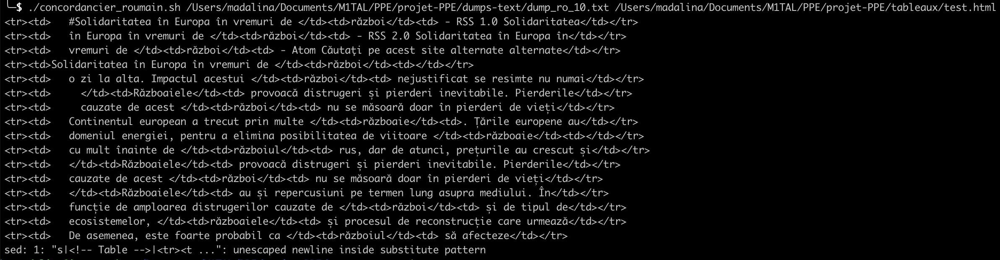

---
layout: page
id: journal_groupe.md

---
# Projet PPE : Analyse du mot GUERRE
### - Elisa LEPLUVIER (Russe)*
### - Kehina MANSERI (Anglais) 
### - Ioana-Madalina SILAI (Roumain)
*Elisa a abandonné le projet pendant le semestre. 

## Choix du mot : 
Nous avons choisi le mot **"Guerre"** à l’unanimité car il était très présent dans l’actualité au commencement du projet.

Initialement, nous avions prévu d’uniquement nous intéresser à la guerre en Ukraine mais l’escalade des affrontements au Moyen-Orient (entre Israël et la Palestine) nous a fait nous rendre compte que des conflicts différents n'étaient pas traités de la même manière dans les médias. Nous avons donc trouvé intéressant de voir si notre intuition était averée en analysant et comparant l'utilisation du mot **"Guerre"** dans des articles sur la guerre **Ukraine-Russe** et des articles sur la guerre **Israël-Palestine**. Nous avons décidé de ne pas prendre en compte la distinction Guerre/Conflit notamment présente pour la guerre Israël Palestine. Cela aurait doubler la charge de travail liée à l'analyse linguistique. 


- **Anglais _WAR_ (Kehina MANSERI) :**
    * **Kehina** : j'ai considéré que le choix du mot **"Guerre"** était intéressant car les médias anglophones (américains, britanniques ou autres) apportent le point de vue "occidental" ou de l'"ouest" sur certains conflits. L'Angleterre comme les États-Unis ont par exemple apporté leur soutien au peuple ukrainien.
    * Dans le cas du conflit Israélo-Palestinien, les États-Unis ont apporté leur soutien à Israël. Nous nous sommes donc demandées si le traitement des deux conflits était différent dans les médias anglophones. 
    * Contrairement à mes camarades, je n'avais que très peu de variations à prendre en compte pour rédiger une expression régulière adaptée à l'anglais. La seule flexion à prendre en compte était le pluriel. Je n'ai pas pris en compte les occurrences du mot "war" avec tous les caractères en majuscules, ces dernières correspondaient en effet généralement à des onglets ou autres mentions distinctes des articles. 
    * L'expression régulière utilisée est : ```(W|w)ars?```
    * Les formes du mot que je vais chercher seront : 
    1. **[Ww]ar** = guerre
    2. **[Ww]ars** = guerres


- **Roumain _Război_ (Ioana-Madalina SILAI) :** 
    * **Maddie** : j'ai consideré que ce mot était intéressant pour le roumain dans le contexte de la guerre en Ukraine. La position geographique du pays en fait en effet un évènement majeur pour la Roumanie.  
    * Lorsque le conflit Israélo-Palestinien a escaladé, il était intéressant de voir la difference entre les mentions de cette guerre et celle de l'Ukraine dans les medias roumains.
    * En ce qui concerne le mot en soi, il s'agit d'un nom du genre neutre (masculin au singulier, feminin au pluriel), qui fait que le mot change beaucoup en fonction du contexte. De plus, en roumain les articles sont des suffixes, donc on ne peut pas les ignorer quand on cherche le mot. 
    * L'expression régulière utilisée est : ```[Rr]ăzbo((iul)|(iului)|(aiele)|(aie)|(aielor)|i)```
    * Les formes du mot que je vais chercher donc seront:
    1. **[Rr]ăzboi** = guerre 
    2. **[Rr]ăzboaie** = guerres
    3. **[Rr]ăzboiul** = la guerre
    4. **[Rr]ăzboaiele** = les guerres
    5. **[Rr]ăzboiului** = à la / de la guerre 
    6. **[Rr]ăzboaielor** = aux / des guerres

- **Russe _Вoйнa_ (Elisa LEPLUVIER) :** 
    * **Kehina** : l'étude du traitement du mot **"Guerre"** semblait directement être intéressante à cause du rôle de la Russie et des pays rusophones dans la guerre en Ukraine. Nous voulions voir si l'utilisation du mot était différente dans les médias du pays instigateur du conflit.
    * La position de la Russie quant au conflit Israélo-Palestinien est différente de celle des pays anglophones (généralement pour Israël). Il était donc intéressant de voir si l'utilisation changeait en fonction de cette prise de position.
    * L'expression régulière du russe posait des problématiques similaires à celle du roumain. Tout comme pour **Război**, le mot **"Boйнa"** varie en fonction du contexte, du genre et du nombre. Il suit les déclinaisons habituelles des substantifs en russe. Elisa a donc proposé l'expréssion régulière utilisée pour ce projet. 
    * L'expression régulière utilisée est : ```[Вв]ойн((ам?и?х?)|(ы)|(у)|(ой)|(е))?```
    * Les formes du mot que je vais chercher donc seronts :
    1. **[Вв]oйнa** = guerre
    2. **[Вв]ойнам** = aux guerres 
    3. **[Вв]ойнaи** = des guerres 
    4. **[Вв]ойнaх** = dans les guerres 
    5. **[Вв]ойны** = guerres
    6. **[Вв]ойну** = guerre
    7. **[Вв]ойной** = par la guerre 
    8. **[Вв]ойне** = dans la guerre
      


## Choix des liens :

En faisant des recherches plus générales, nous avons remarqué qu’il y avait plusieurs types de sites pouvant contenir le mot **« Guerre »**. La majorité était des sites d’actualités et le reste des sites d'informations plus générales sur les guerres (par conflit et dans le domaine culturel ou sportif). 

Après plusieurs essais, nous nous sommes donc mises d’accord pour avoir **50 liens chacune** dont **20 sur la guerre en Ukraine**, **20 sur le conflit Israélo-Palestinien**, et le reste sur les généralités citées précedemment. 


## Script pour la création des tableaux :
Après avoir choisi notre mot, nous avons utilisé le script du mini-projet adapté aux besoins de notre projet. 

- Nous avons commencé par ajouter une colonne **« Aspirations »** à notre tableau. Cette colonne contient un lien amenant à la page html de chacun de nos liens. Comme nous avions déjà une variable N qui comptait le nombre de liens dans la liste, nous l’avons ré-utilisé pour nommer tous nos fichiers html sous la forme `« url_<langue>_$N.html »`. 

```
ASPIRATION=$(curl -s -L ${line} > ../aspirations/url_en_$N.html)
```

- Nous avons ensuite ajouté une colonne **« Dump »** à notre tableau. Cette colonne contient un lien amenant à un fichier texte contenant uniquement le contenu textuel de chaque page web. Pour obtenir ce contenu textuel, nous avons utilisé la commande **lynx** :

```
DUMP=$(lynx -dump -nolist --display_charset=utf-8 ../aspirations/url_en_$N.html > ../dumps-text/dump_en_$N.txt)
```

Nous avons précisé à Lynx l'encodage d'affichage de chacun de nos fichiers essentiellement pour pouvoir afficher correctement les caractères diacrités du roumain et l'alphabet cyrillique. 


_Ioana-Madalina SILAI :_ J'utilise Safari comme browser principal, qui n'ouvre pas les fichiers dumps avec l'encodage UTF-8, sauf si on fait un changement dans les paramètres du browser à chaque ouverture d'un nouveau fichier dump. Je ne sais pas s'il y a une autre commande que je devrais utiliser dans ce cas, car je n'ai pas trouvé de solution, à part utiliser un autre browser.


- Nous avons ensuite ajouté une autre colonne **« Nombre d'occurrences »** à notre tableau. Cette colonne contient le nombre d'occurrences du mot "guerre" dans chaque fichier dump crée précedemment. Pour obtenir ce nombre, nous avons utilisé les commandes **egrep** et **wc** associées à nos expressions régulières : 

_Kehina MANSERI:_ 
```
WORDCOUNT=$(cat ../dumps-text/dump_en_$N.txt | egrep -o "(W|w)ars?"| wc -w)
```
_Ioana-Madalina SILAI :_ 

```
WORDCOUNT=$(cat ../dumps-text/dump_ro_$N.txt | egrep -o "[Rr]ăzbo((iul)|(iului)|(aiele)|(aie)|(aielor)|i)"| wc -w)
```

- Nous avons également ajouté une colonne **« Contextes »** à notre tableau. Cette colonne contient un lien menant à un fichier texte contenant toutes les occurrences du mot "guerre" entourées par une ligne de la page web de chaque coté. Pour obtenir une ligne avant et après le mot nous avons utilisé l'option `-C 1` après la commande **egrep**. Nous avons aussi utilisé la commande **sed** pour supprimer les éventuelles lignes vides (avant ou après notre mot) :

_Kehina MANSERI:_ 
```
cat ../dumps-text/dump_en_$N.txt | sed '/^$/d'| egrep -C 1 "(wars?)|(WARS?)" > ../contexte/contexte_en_$N.txt
```

_Ioana-Madalina SILAI :_ 

```
cat ../dumps-text/dump_ro_$N.txt | sed '/^$/d'| egrep -C 1 "[Rr]ăzbo((iul)|(iului)|(aiele)|(aie)|(aielor)|i)" > ../contexte/contexte_ro_$N.txt
```


- Enfin, nous avons ajouté une colonne **« Concordances »** à notre tableau. Nous avions initialement rencontré de grandes difficultés ici : 

    *Semaine du 21 novembre 2023*

    Nous avons essayé de faire le dernier exercice de la fiche "Concordances". Nous avons premièrement cherché à garder uniquement jusqu'à 5 mots à gauche et à droite des occurences de notre mot cible. 
    Nous avons crée un script spécifique pour cet exercice (`concordancier_roumain.sh`) que nous avions prévu d'appeler dans notre script principal. 

    Pour celà, nous avions utilisé **sed** pour essayer de supprimer le mot et le contexte droit (pour obtenir le contexte gauche) et inversement. **Nous n'avons cependant pas réussi à remplacer notre commentaire $TABLE par le résultat de notre script "concordance". Nous obtenions l'erreur :** 

    

    Nous avons essayé de remplacer les pipes par d'autres caractères. Nous avons également essayé d'ajuster notre expression régulière car nous avons appris que **sed ne prend pas plus de 9 groupes d'expressions régulières**. Même si cette commande fonctionne bien dans notre script principal, elle ne semble pas fonctionner ici.


    *Semaine du 28 novembre 2023*

    Nous avons modifié la présentation de notre fichier (`miniprojet_roumain`) afin d'avoir une ligne "TABLEROW" pour chacune de nos variables. Nous avons également reformulé notre ligne correspondant à la variable CONCORDANCE_TABLE dans notre fichier (`concordancier_roumain.sh`). 

    *Semaine du 5 décembre 2023*

    Nous avons voulu créer la colonne **« Concordances »** dans les tableaux russe et anglais afin de pouvoir commencer la mise en page de notre page GitHub. Nous avons cependant recontré deux obstacles différents. 

    **Pour ce qui est du concordancier anglais**, nous avons rencontré des difficultés en rapport avec l'encodage de nos pages web. En effet, après avoir adapté nos scripts en se basant sur ceux du roumain, nous obtenions toujours la même erreur : 
    
    `sed: -e expression #1, char 18205: unterminated s' command`.

    Il semblait y avoir un problème avec notre commande **sed** utilisée ici pour obtenir nos contextes droit et gauche. Nous avions bien remplacé les valeurs à remplacer dans notre scripts (ce qui incluait les noms des fichiers à prendre en compte ainsi que le nombre de groupes "match" de notre expression régulière) et ne comprenions donc pas le problème. Toutes ces erreurs étaient  rencontrées sur l'ordinateur de Kehina (Asus sous Linux). En executant notre script sur l'ordinateur de Maddie (un mac), nous obtenions une erreur différente : 
    
    `illegal byte sequence`. 

    En recherchant cette erreur sur internet, nous avons compris qu'elle se produisait lorsqu'un fichier avec des caractères majoritairement ASCII était donné à un opérateur qui attendait de l'UTF-8. Tous nos fichiers étaient cependant bien encodés en UTF-8. **Les erreurs semblaient systématiquement provenir des pages Wikipédia** qui contenaient des caractères diacrités et encodés sur plus de 1 octet. **Lynx** semblait alors interpréter ces caractères en ASCII alors qu'ils ne pouvaient pas être reconnus par cet encodage. Nous avons donc décidé d'utiliser `LINKS` au lieu de `LYNX` et notre problème s'est résolu. Nous avons ensuite ajouté une colonne **« Concordances »** à notre fichier (`tableau_anglais`) et mis à jour nos scripts.

    **Pour ce qui est du russe**, notre problème était au niveau du nombres de "matches" acceptés par la commande **sed** pour ce qui est des expressions régulières. La limite de ces matches étant de 9, il était impossible pour nous d'inclure tous les groupes "matches" de notre expression régulière, qui en comptait 8, ainsi que du contenu textuel de groupe de droite et de gauche. Nous aurions eu besoin d'une limite de 10.

    **Nous avons donc modifié notre expression régulière pour que cette dernière ne reconnaisse uniquement que 6 groupes "matches" :**

    ```[Вв]ойн((а)|(ы)|(у)|(ой)|(е)|(ам)|(ами)|(ах))``` -> 
    
    ```[Вв]ойн((ам?и?х?)|(ы)|(у)|(ой)|(е))?```

*Semaine du 26 décembre*

- Division de nos tableaux : 

Nous avons choisi de diviser nos 50 liens par thématiques (20 liens pour la guerre en Ukraine, 20 liens pour le conflit israëlo-palestinien et 10 liens pour la guerre en général). Initialement, nous avions une boucle `while` qui permettait d'effectuer des manipulations sur l'ensemble de nos liens. En voulant faire cette division par thématique, il aurait fallu faire trois boucles `while`. Nous avons préféré avoir recours à une fonction qu'on a appelé trois fois en donnant comme argument le nom du conflit qui a ensuite été inseré dans les noms des fichiers résultants du script. 

Cette modification nous a également poussé à changer notre commande `sed` en `awk` à la fin de notre script. `sed` nous permet d'effectuer des transformations assez basiques sur du texte car il fonctionne ligne par ligne. Nous pouvons l'utiliser pour des suppressions, substitutions ou insertions simples. `awk` peut-elle effectuer des transformations plus complexes sur du texte. Elle est notamment plus adaptée à des données structurées comme le sont les colonnes d'un tableau. Nous avons utilisé la commande : 

```
awk -v table="$TABLE" '/<!-- Table '"$2"' -->/{print table; next} 1' "$FILE_PATH_OUT"
```
Dans notre cas, nous avons utilisé `awk` pour insérer le tableau généré par le script dans notre template html. La partie `awk -v table="$TABLE"` donne la valeur de notre variable shell `"$TABLE"` à une variable awk nommée `"table"`. La partie /<!-- Table '"$2"' -->/{print table; next} permet de faire en sorte que si la ligne match `<!-- Table $2 -->`, elle va être remplacée par le contenu de la variable `"table"`.
 Enfin, `1` vient imprimer la ligne entièrement.

Nous avons ensuite modifié nos templates html en dupliquant trois fois nos tableaux. 

## Création des pages HTML :

**Nous avons choisi d'utiliser un template html à la place d'avoir les balises html dans notre script bash pour faciliter la lecture et éviter de relancer à chaque fois notre script lors des futures modifications de la page.**

Nous avons donc ajouté à la fin de chacun de nos scripts la ligne suivante : 

```
sed "s|<!-- Table -->|$TABLE|g" template_anglais.html > "$FILE_PATH_OUT"
```

Nous venons remplacer le commentaire < !-- Table -- > qui se trouve dans le template par le tableau que nous obtenons lorsque nous excécutons le script. 
Nous avons également remplacé les slashs (la syntaxe initiale étant `sed "s/element_a_remplacer/element_remplaçant/g"`) par des pipes pour éviter les mauvaises interprétations. 

_Nous avions initialement utilisé `sed` pour cette partie du projet. Comme indiqué précédemment, quand nos scripts sont devenus plus complexes, nous avons finalement décidé d'utiliser la commande `awk`._

## Analyse I-Trameur : 

*Semaine du 29 novembre*

Nous avons fait le script pour introduire les balises qui lui permettront d'être chargé sur Itrameur.

```
cat ../dumps-text/dump_${URL_LANG}_$N.txt | sed "s|&|&amp;|g" | sed "s|<|&lt;|g" | sed "s|>|&gt;|g" >> $FOLDER/dump-$URL_LANG.txt
cat ../contexte/contexte_${URL_LANG}_$N.txt | sed "s|&|&amp;|g" | sed "s|<|&lt;|g" | sed "s|>|&gt;|g" >> $FOLDER/contexte-$URL_LANG.txt
```

**L'écriture de ce script s'est avéré assez simple car il nous a suffit de ré-utiliser des concepts appris auparavant. De plus, comme nous donnons le code de la langue en argument (ro, ru ou en), nous n'avons pas eu besoin de faire 3 scripts différents.**

*Semaine du 12 décembre* 

Nous avons remarqué une erreur dans notre script générant les fichiers **contexte-$URL_LANG.txt** et **dump-$URL_LANG.txt**. Nos fichiers se créeaient en écrasant le précédent à chaque itération. Nous avons résolu cette erreur en adaptant le nombre de chevrons. 

## Programmes Python Autonomous Lafon specificity Scripts (PALS) :

Nous avons eu beaucoup plus de mal avec cette partie du travail car elle n'était pas clairement expliquée sur la fiche d'exercices. Nous ne savions par exemple pas si elle était reservée aux groupes avec certaines langues ou non.

**Nous avons initialement essayé d'uiliser le programme coocurrences avec les fichiers obtenus grâce au script Itrameur mais les résultats nous ont paru étranges.** Nous avons donc relu la documentation plus attentivement et nous nous sommes rendues compte que les scripts python peuvent analyser des fichiers textes seulement s'ils sont déjà **tockénisés** et s'il y a au moins une ligne vide entre chaque phrase. 
**Pour cela, nous avons écrit un script à partir d'une commande qui semblait fonctionner dans le terminal :**

```
	cat ../dumps-text/dump_ro_1.txt | tr -cs "[:alpha:]." "\n" | sed "s/\./\n/g"
```

**Notre script fonctionnait parfaitement pour l'anglais mais ne semblait pas fonctionner pour le roumain.** Le fichier obtenu remplaçait les caractères diacrités par des sauts de ligne malgré l'encodage du fichier en UTF-8 (vu sur l'éditeur de texte et confirmé par les commandes `chardet` et `uchardet`).

Après de longues recherches, il s'est avéré que **le problème résidait dans le nom que nous avions attribué à l'une de nos variables.** En effet, nous avions appelé la variable qui correspondait à la langue du nom de notre fichier **"LANG"**. Ce nom se confondait alors avec les paramètres de notre **locale**. Nous avons donc fini par la renommer **"URL_LANG"**.

**Nous avons ensuite lancé le programme coocurences avec le fichier obtenu.** Il est compliqué de savoir si nos résultats sont bons car les données ne s'affichent pas correctement et que nous avons du mal à comprendre ce à quoi correspond chaque valeur et colonne.

Nous n'avons également pas énormement compris ce que l'on devait faire avec nos résultats I-trameur. Nous avons attentivement regardé les projets de l'année dernière et beaucoup avaient utilisé des captures d'écran mais il n'était précisé nulle-part dans la fiche que nous devions faire de même ou ajouter des pages HTML ou écrire des analyses de nos résultats.

Nous ne sommes enfin pas sûre de comprendre s'il faut obtenir un seul fichier avec les contextes concaténés de chaque langue ou bien garder un fichier par langue.

Pour ce qui est de l'interface graphique, nous sommes inquiètes de ne pas avoir le temps de créer notre page. Nous ne savons pas s'il faut suivre les thèmes graphiques des années précédentes ou bien faire complétement autre chose.

*Semaine du 26 décembre* 

Les analyses du roumain et de l'anglais ont été rédigées par Kehina et Maddie. Les fichiers dumps ont été utilisés pour I-trameur et le programme PALS.

## Mise en page de notre site dédié :

**Choix du thème**

*Semaine du 5 décembre*

**Nous avons commencé par chercher un thème sur Bulma** qui pourrait être utilisé pour la présentation finale de notre projet. Nous nous sommes finalement mise d'accord sur le thème suivant **(Nous étions très fans de la sidebar)** : https://hyde.getpoole.com


En lisant la page GitHub du thème (https://github.com/poole/hyde), **nous nous sommes rendues compte qu'il fallait utiliser Jekyll pour implémanter le thème.** Nous sommes allées sur le site Jekyll et avons lu la documentation (http://jekyllrb.com/docs/) permettant d'installer Jekyll sur nos machines. **Nous avons appris que Jekyll nous permet de voir la reconstruction du site en temps réel sans avoir à passer par GitHUb en utilisant la commande :** 

```
bundle exec jekyll serve
```
Nous avons télechargé les fichiers du thème et les avons mis dans notre dépôt GitHub partagé. Nous nous sommes rendues compte qu'il y avait beaucoup de caractéristiques du thème que nous n'allions pas utiliser. Nous nous sommes alors renseignées sur les fichiers que nous pourrions supprimer sans danger, nous avons par exemple supprimé le fichier **post** car nous ne désirions pas utiliser ces derniers sur notre site. **Comme le thème a été crée en 2015, nous avons eu du mal à comprendre comment adapter la logique de Jekyll à notre projet.** 

Nous avons testé le template à l'aide d'un fichier précédemment crée mais nous nous sommes rendues compte que les tableaux crées étaient trop larges. 

**Nous avons réussi à inclure le mot "Guerre" comme titre du site et à ajouter le lien vers nos tableaux html sur la page d'accueil.**

*Semaine du 12 décembre*

Nous avons crée des fichiers Markdown pour nos pages. Nous y avons écrit quelques lignes de texte afin de tester le bon fonctionnement de ces dernières. 

Nous avons premièrement modifié le script Jekyll pour affiner le contenu et l'apparence de notre sibebar. **Nous avons notamment lu la documentation pour apprendre à créer des variables dans le langage utilisé par Jekyll (Liquid)** afin de changer nos pages plus facilement à partir du fichier config.yml. Nous avons crée des variables spécifiques à chaque page.
Après de nombreuses erreurs de syntaxe dans les fichiers sidebar et config, nous avons finalement réussi les bonnes ocmbinaisons.

Nous avons ensuite décidé de nous concentrer sur les sous-menus de notre sidebar en commencant par les sous-menus de notre page **"Tableau"**. Nous avons appris à ajouter des sous-pages dans le fichier config_yml en utilisant des boucles for et if avec liquid. Nous voulions changer l'apparence visuel de nos sous-menus. **Nous avons alors modifié le script css.** 
Nous nous sommes rendues compte que nous avions besoin d'un lien entre notre site et nos tableaux html, nous avons donc utilisé les sections de code proposées par Bulma pour ajouter des **breadcrumbs** en haut de nos pages tableaux permettant donc de revenir à notre page d'accueil ou à la description générale de la page tableau. 

*Semaine du 26 décembre* 

Nous avons crée tous les sous-menus de notre site en créant des fichiers markdown spécifiques et en les ajoutant au fichier config.yml. Nous avons fait en sorte que lorsque l'on clique sur un sous-menu, les autres restent affichés dans la side-bar. Pour cela, nous avons trouvé (en cherchant dans la documentation), la fonction *contains* que nous avons utilisée dans le fichier sidebar.html. Ce changement nous a donné le bout de script suivant : 


```


        
        <a class="sidebar-nav-item active" href="{{ site.baseurl }}/{{ item.name }}/">{{ item.title }}</a>
        
          
            
            <a class="sidebar-nav-item child sidebar-nav-item active" href="{{ site.baseurl }}/{{ item.name }}/{{ child.name }}">{{ child.title }}</a>
          
        
      

```

Nous avons également rédigé le contenu de chacune des pages racines de notre sidebar.


